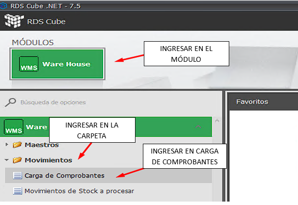

# ¡Bienvenido a RDS CUBE!

Esta guía de documentación está diseñada para ayudarte a dominar todas las funcionalidades de nuestro ERP, desde las tareas más básicas hasta las operaciones más complejas.

## ¿Qué encontrarás aquí?

Hemos organizado los manuales por módulos para que puedas encontrar fácilmente la información que necesitas:

- **Módulo de Clientes:** Cómo gestionar altas, bajas y modificaciones de clientes.
- **Módulo de Facturación:** Creación y gestión de facturas, notas de crédito y débito.
- **Módulo de Stock:** Control de inventario, movimientos y ajustes.

## Requisitos Previos

Para empezar a utilizar RDS CUBE, solo necesitas:
1.  Tus credenciales de acceso (usuario y contraseña).
2.  Un navegador web actualizado.
3.  ¡Muchas ganas de optimizar tu gestión!