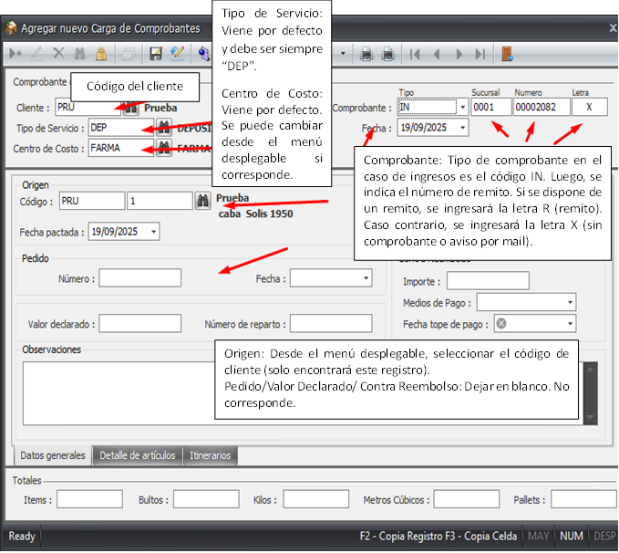

Carga de comprobante: Mediante este proceso se ingresa la información del remito del cliente en el sistema. La mercadería aún no está en el stock.

## Paso 1: Acceder a Carga de Comprobantes

1.  Ingresar en el módulo **WAREHOUSE**, carpeta **MOVIMIENTOS** y seleccionar **CARGA DE COMPROBANTES**.

    

2.  Para ingresar un nuevo registro, clickear el ícono de "Nuevo".

    

    

## Paso 2: Completar los Datos del Encabezado

3.  A continuación, se mostrará el siguiente formulario, colocaremos el codigo del cliente o lo buscaremos y seleccionaremos.

    

4.  Cargar la informacion correspondiente

    

## Paso 3: Cargar los Artículos

5.  Ir a la solapa **DETALLE de ARTICULOS** y cargar los articulos necesarios

    

6. Indicar la cantidad de bultos

    

## Paso 4: Cargar de la informacion restante

7. Indicar el resto de la inforamcion:  **TIPO DE STOCK,
NRO. DE SERIE, LOTE, FECHA DE LOTE, PARTIDA, DESPACHO,
FECHA DE VENCIMIENTO,IDENTIFICACIÓN CONTENEDOR:
UNIDAD**

    

8. Se pueden agregar datos adicionales y luego clic en guardar

    

