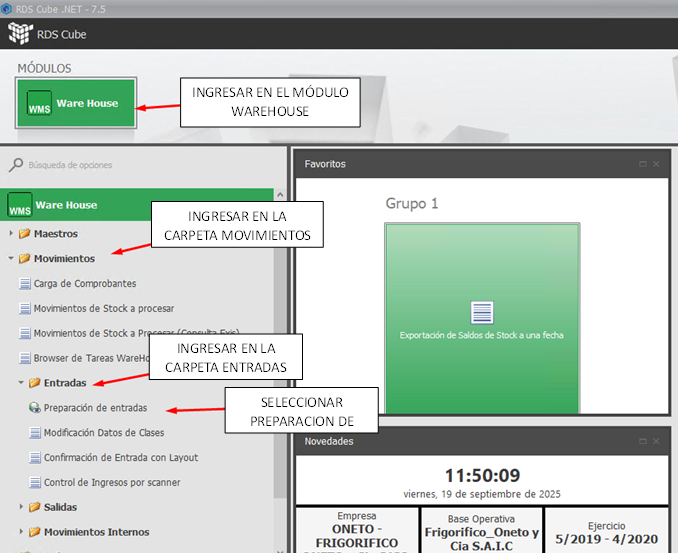

### Paso 1: Ingresar al Modulo Correspondiente

Ingresar en el módulo WAREHOUSE, carpeta MOVMIENTOS/ ENTRADAS y seleccionar PREPARACION DE ENTRADAS.

## Further reading

- Read [about reference](https://diataxis.fr/reference/) in the Diátaxis framework
