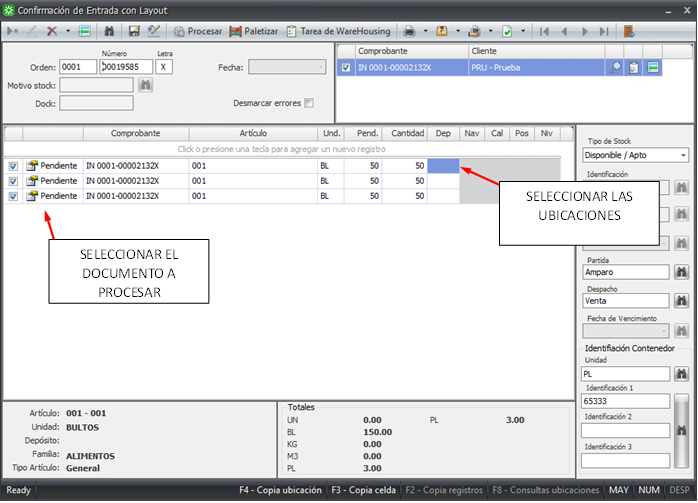

### Paso 1: Acceder a Confirmacion de Entrada por Layout
---

Ingresar en el módulo WAREHOUSE, carpeta MOVIMIENTOS/ ENTRADAS y seleccionar CONFIRMACION DE ENTRADA CON LAYOUT

---

### Paso 2: Realizar la busqueda o ingreso del comprobante a procesar
---
Clickear el ícono para seleccionar la orden de procesamiento o remito. Si la orden contiene varios remitos (orden consolidada), traerá todos los remitos.

---

Las líneas de todos los remitos aparecen en estado Conteo.
Completar para cada una de las líneas (ítems) la información que se solicita a la derecha.\
Clickear el botón Paletizar. En caso de que el artículo este configurado para que trabaje con unidad contenedora desde el maestro de artículos, la función de este botón es de paletizar los artículos que tengamos dentro de la orden de procesamiento, asignándoles una unidad contenedora y su respectiva identificación de manera automática.

### Paso 3: Confirmar cantidades

---
En esta instancia se deben confirmar las cantidades. Si existe alguna diferencia entre lo indicado en el remito y lo que se está controlando físicamente, se puede modificar en la columna cantidad.

---

---

### Paso 4: Agregar ubicaciones

--- 

- Ingresar de nuevo a “Confirmación de Entrada con Layout” y hacer clic en buscar   y allí seleccionamos de nuevo la orden a procesar.\
- Ingresar el código de depósito (con F9 se muestra toda la tabla).\
- El sistema pregunta si se asigna el mismo depósito a todos los registros. Lo copia en el caso afirmativo.\
- Indicar nave, calle, posición y nivel. Con F9 se muestran las posibilidades.\
- Al posicionarse sobre el renglón siguiente para asignar ubicación, se puede presionar la tecla F4 para repetir todas las ubicaciones. Esto es especialmente útil en el caso que la ubicación tenga capacidad para muchos pallets. De este modo se simplifica el ingreso manual de ubicaciones.\
- Grabar nuevamente.

---

---

### Paso 5: Entrada de la mercaderia al stock del cliente
--- 
- Ingresar por tercera vez clickeando el ícono de busqueda.\
- Trae las órdenes que ya tienen ubicación asignada en estado Procesado.\
- Seleccionar estos registros e indicar el Motivo de stock. En este caso es Entrada de Pallet.\
- Al volver a grabar, la mercadería ya figura en el stock de la compañía en las ubicaciones definidas.

---

---

---

---
## Further reading

- Read [about reference](https://diataxis.fr/reference/) in the Diátaxis
