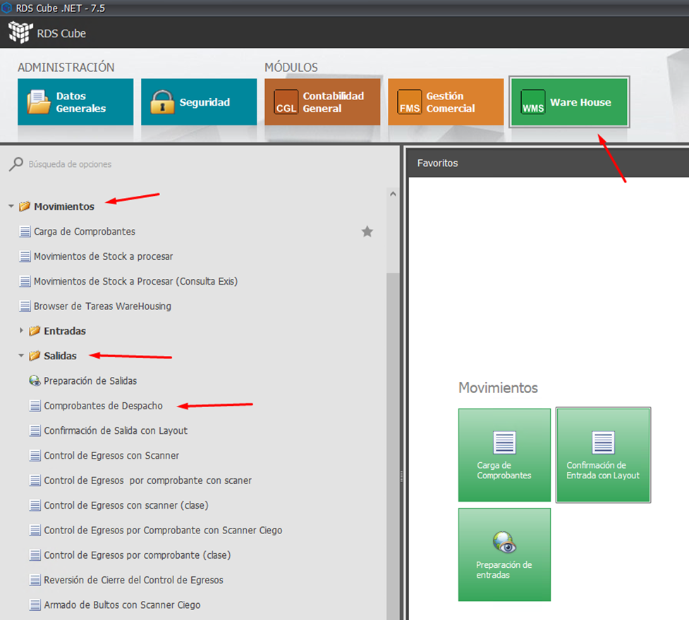
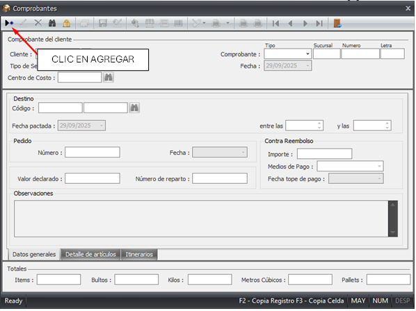
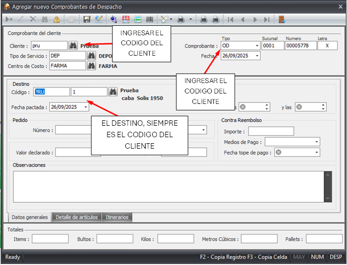
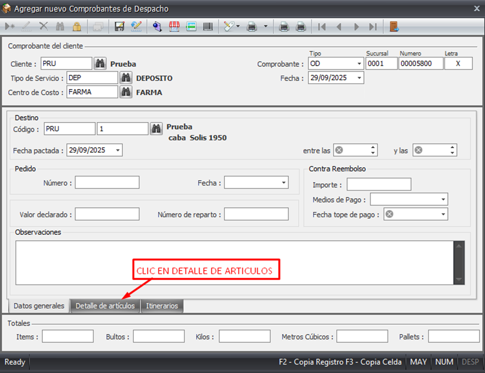
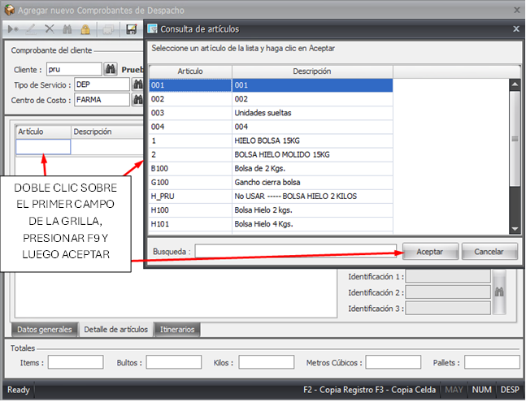
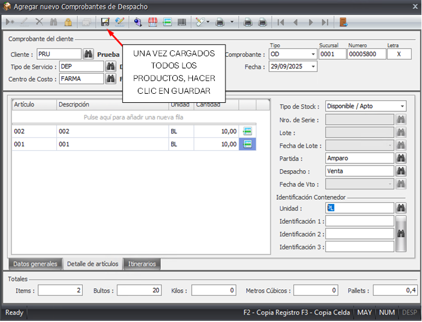

## Paso 1: Acceder a Comprobantes de despacho
---
- Ingresar en el módulo WAREHOUSE, carpeta MOVIMIENTOS / SALIDAS y seleccionar COMPROBANTES DE DESPACHO.

---

---
## Paso 2: Crear el nuevo comprobante de despacho
---

- Para ingresar un nuevo registro clickear el ícono:  

---
Cargar los siguientes datos:

- Cliente: Código del cliente. Se puede seleccionar desde menú desplegable clickeando el botón  
- Tipo de Servicio: Viene por defecto cuando se ingresa el código de cliente. Debe ser siempre DEP – DEPOSITO. 
- Centro de Costo: Viene por defecto cuando se ingresa el código de cliente. Se puede cambiar desde el menú desplegable si corresponde.
- Comprobante: Tipo de comprobante del comprobante que se desea ingresar. En el caso de ingresos es el código IN. A continuación, se indica el número de remito. Si se dispone de un remito, se ingresará la letra R (remito). Caso contrario, se ingresará la letra X (sin comprobante o aviso por mail).
- Origen: Desde el menú desplegable, seleccionar el código de cliente (solo encontrará este registro).
- Pedido / Valor Declarado / Contra Reembolso: Dejar en blanco. No corresponde.
---

---
## Paso 3: Agregar los datos de los articulos a retirar
---
- Ir a Detalle de articulos.
- En esta solapa se muestran los datos del encabezado (Cliente, Comprobante, etc.). 
- Artículo: Código del artículo. Posicionarse sobre el primer campo de la grilla y presionar F9. Esto levantara una pantalla de consulta mostrando todos los artículos asociados al cliente que cargamos en el comprobante.
Trae la descripción del artículo y la unidad de base.  
- Se debe indicar la cantidad ingresada en la unidad de base (indicada en la columna anterior).
- Tipo de Stock: La mercadería ingresa siempre como DISPONIBLE. 
- Nro. de serie, Lote, Fecha de lote: Se mostrará habilitado cuando en el maestro de artículos se haya indicado que deben registrarse estos datos.
- Partida: Este campo se empleará para indicar el NUMERO DE AMPARO. En este caso se debe configurar que sea solicitado para el artículo.
- Despacho: Este campo se empleará para indicar el NUMERO DE VENTA. En este caso se debe configurar que sea solicitado para el artículo.
- Fecha de Vencimiento: Se mostrará habilitado cuando en el maestro de artículos se haya indicado que deben registrarse estos datos.
- Identificación Contenedor:
Unidad: No indicar nada en esta instancia. Solo indicar si se quiere asignar un mismo número de identificación a todo el conjunto de pallets a ingresar del ítem en cuestión.
Identificación 1-2-3: El sistema asignará un número automáticamente si se ha indicado Unidad en el campo anterior.
- Totales: Muestra la suma total de los detalles de artículos cargados en el comprobante: Items, Bultos, Kilos, Metros Cúbicos, Pallets 
- Datos de Ingreso: Permite ingresar la información del transporte.
- Datos Adicionales: Campo libre para notas.

---

---
- Agregar los articulos
---

---

---

## Paso 4: Guardar
---

---

## Further reading

- Read [about reference](https://diataxis.fr/reference/) in the Diátaxis framework
