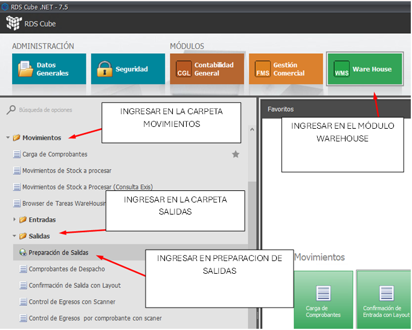
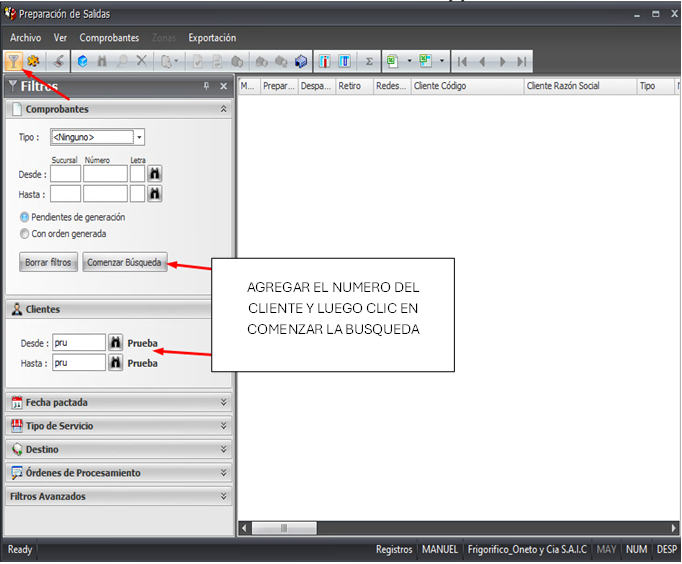
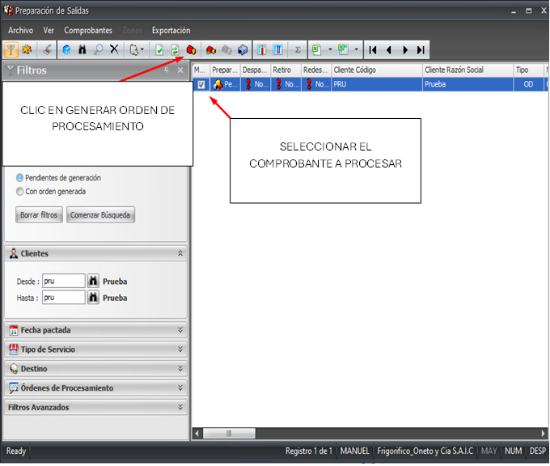
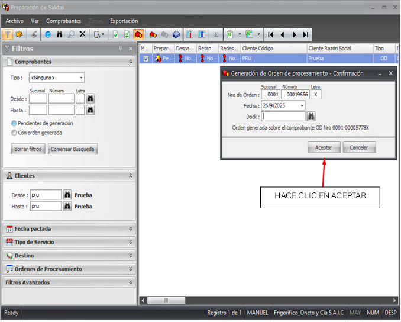
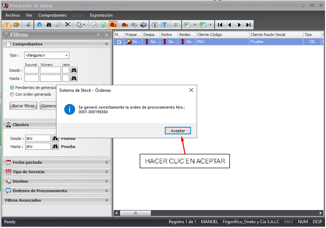

### Paso 1: Acceder a Preparación de Entradas

- Ingresar en el módulo WAREHOUSE, carpeta MOVIMIENTOS/ SALIDAS y seleccionar PREPARACION DE SALIDAS.

---

### Paso 2: Realizar la busquedo o ingreso del comprobante a procesar
--- 

Lo primero que se debe hacer es filtrar los documentos que se quieren procesar, indicando alguno de los campos que se indican en la imagen.
En todos casi todos los campos se puede realizar la busqueda usando el botón de los binoculares.
Luego de ingresar los criterios de busqueda  Clickear botón COMENZAR BUSQUEDA y apareceran al costado los comprobantes filtrados.  

--- 

---
## Paso 3: Seleccionar el o los comprobantes a procesar

- Seleccionar los registros que se quieren procesar.
- Pueden seleccionarse uno a uno para generar ordenes por separado o bien seleccionar varios y generar una sola orden de guardado.

---

---
## Paso 4: Procesar los comprobantes
---
- Se abre una pantalla de confirmación de datos y hacemos clic en aceptar.
---

 ---
