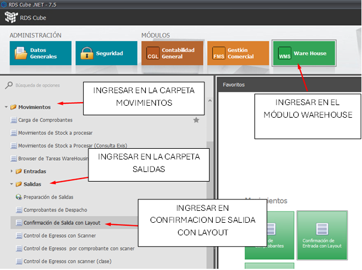
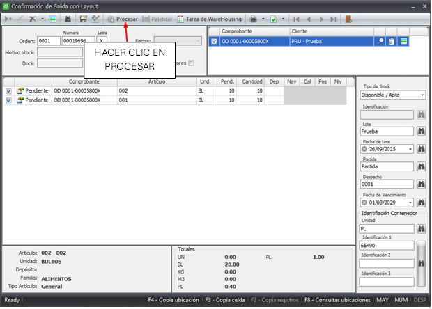
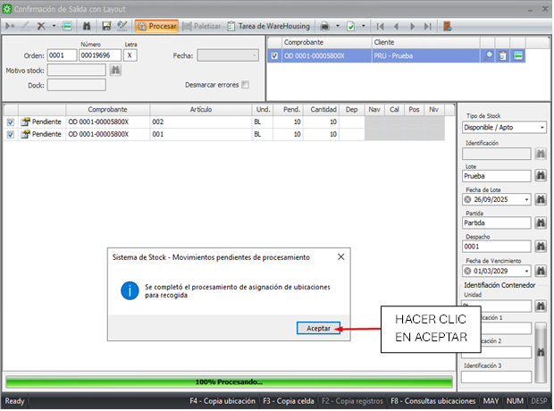
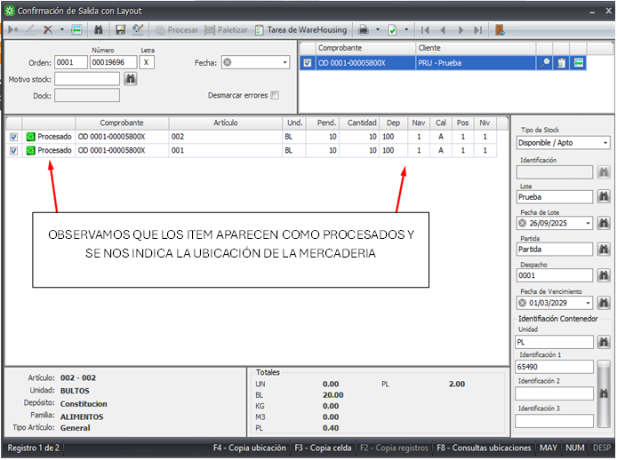
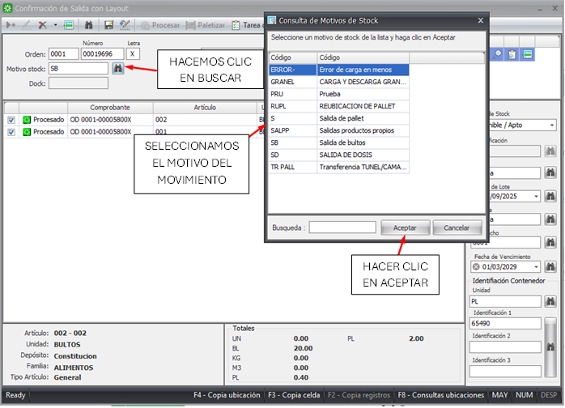
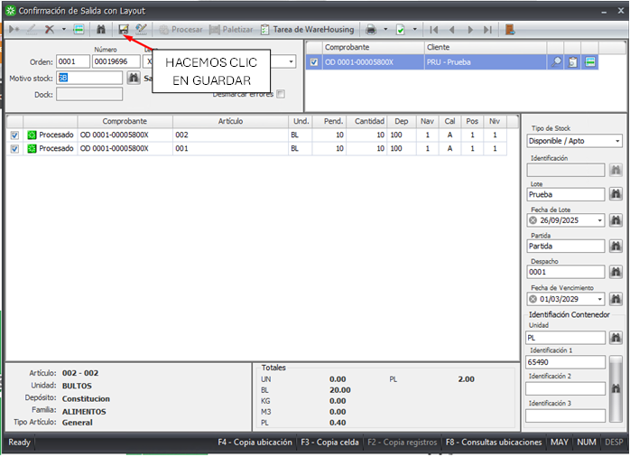

### Paso 1: Acceder a Confirmacion de Salida con Layout
---

- Ingresar en el módulo WAREHOUSE, carpeta MOVIMIENTOS/ SALIDAS y seleccionar CONFIRMACION DE SALIDA CON LAYOUT.

---

### Paso 2: Realizar la busqueda o ingreso del comprobante a procesar
---
- Clickear el ícono buscar para seleccionar la orden de procesamiento. 
- Si la orden contiene varios remitos (orden consolidada), traerá todos los remitos.
---

---
- Antes de hacer clic en **PROCESAR**, se deben confirmar las cantidades. 
- Si existe alguna diferencia entre lo indicado en el remito y lo que se está controlando físicamente, se puede modificar en la columna cantidad.
- La asignación de ubicaciones puede ser de forma automática desde el botón procesar, o de forma manual. 
- Para ello se debe posicionar sobre el campo del depósito y con la tecla F9 muestra los depósitos disponibles, una vez que se asignó el depósito va a habilitar la nave, y así sucesivamente con la calle, posición y nivel. 
- Cabe aclarar que es un requisito tener los mismos datos de clase (tipo de stock, lote, fecha de lote, etc) de la mercadería que ingresó a stock, de no ser así no.

---

---

### Paso 3: Confirmar cantidades y Asignación de ubicaciones

---
- En esta instancia se deben confirmar las cantidades. Si existe alguna diferencia entre lo indicado en el remito y lo que se está controlando físicamente, se puede modificar en la columna cantidad.
- La asignación de ubicaciones puede ser de forma automática desde el botón procesar, o de forma manual. 
- Para ello se debe posicionar sobre el campo del depósito y con la tecla F9 muestra los depósitos disponibles, una vez que se asignó el depósito va a habilitar la nave, y así sucesivamente con la calle, posición y nivel. 

---

---

---

### Paso 4: Salida de la mercaderia al stock del cliente
--- 
El siguiente paso sería asignarle un motivo de stock de salida. Luego de asignarle el motivo de stock lo único que nos queda es cliquear grabar y nuestra orden habrá cumplido el ciclo de confirmación de salida descontando la cantidad confirmada de stock.

- Ingresar por tercera vez clickeando el ícono de busqueda.
- Trae las órdenes que ya tienen ubicación asignada en estado Procesado.
- Seleccionar los registros e indicar el Motivo de stock. En este caso es Entrada de Pallet.
- Al volver a grabar, la mercadería ya figura en el stock de la compañía en las ubicaciones definidas.

---

---

---

---

---
## Further reading

- Read [about reference](https://diataxis.fr/reference/) in the Diátaxis
